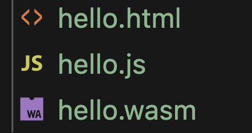
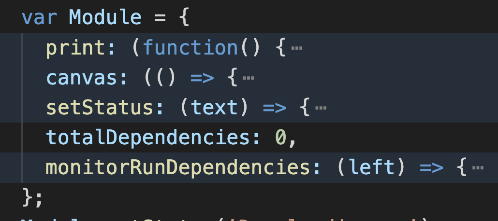
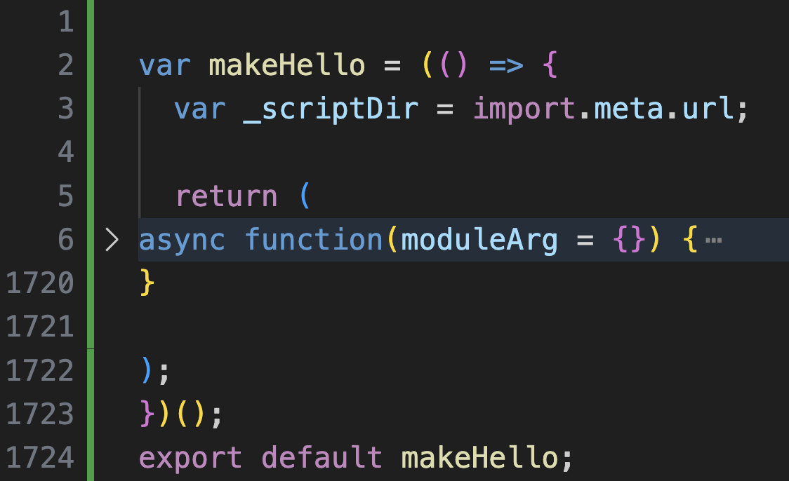
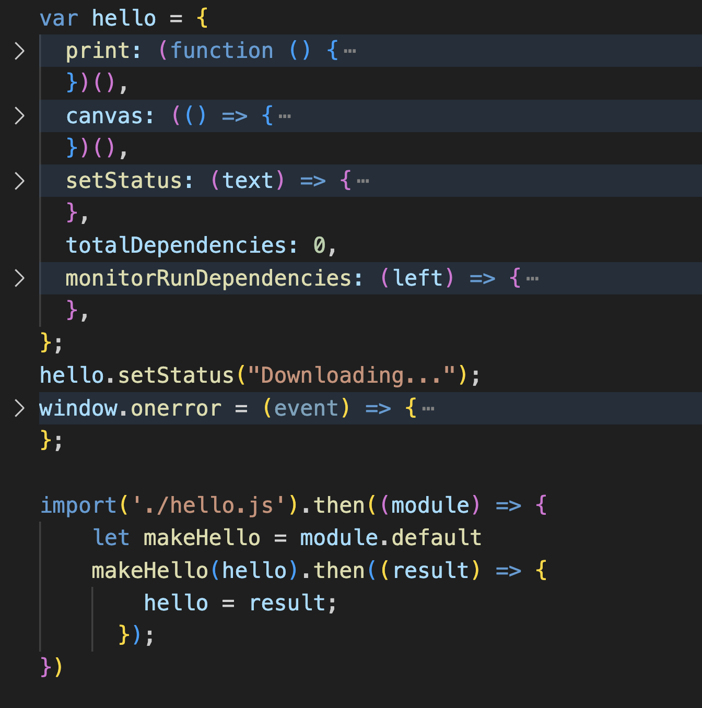
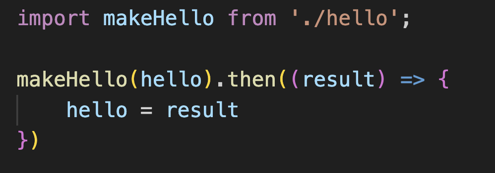

# whisper.cpp for ScribeAR

See [the original repo](https://github.com/ggerganov/whisper.cpp) for README of whisper.cpp

## A Primer on WASM

### What is WASM?

To paraphrase [wikipedia](https://en.wikipedia.org/wiki/WebAssembly), WebAssembly (WASM) was created to let us to run code at "near-native" speed on the front-end. 

WASM achieves this by creating a binary-format, low-level, compiled language that can be directly executed by a browser. Developers would code in a high level language, i.e. C, then use a special compiler to compile their code to WASM code, which can then be served to the frontend and ran. (Constrast this with javascript, which is sent as plain text to the browser and *interpreted*)

Since WASM is an open standard, many compiler toolchains exist. For ScribeAR we chose [emscripten](https://emscripten.org/docs/introducing_emscripten/about_emscripten.html),  a gcc-like C / C++ to WASM compiler - mainly because whisper.cpp chose that.

### How does Emscripten work?

Refer to the [MDN](https://developer.mozilla.org/en-US/docs/WebAssembly/Concepts) and [Emscripten](https://emscripten.org/docs/compiling/index.html) official documentations for more juicy info. We recommend going through this [tutorial](https://developer.mozilla.org/en-US/docs/WebAssembly/C_to_Wasm) first to get a feeling of it running.

Similar to gcc, emscripten takes in a bunch of `.c` or `.cpp` files, and compiles them into a single executable `.wasm` file. However, since the `.wasm` file must be able to intereact with a webpage (and the browser at large), it also generates a 'glue' `.js` file that loads and supports the WASM code. Optionally, it can also generate a demo `.html` file that runs the WASM code, but we will soon see how to run the WASM code in our own webpage.



Also similar to gcc, what exactly emscripten outputs can be controlled with the `-o` flag.

The demo `hello.html` file just runs the WASM code and print out the output. How does it do that? If you dig into it, you should see two `<script>` elements. The first sets up a *global* object called `Module` with some members, and the second one just includes the glue `hello.js` file.



This `Module` object serves as an interface between `hello.html` (and our js code in general) and the WASM code. Recall that when an `html` file is loaded, the (non-module non-async) scripts are ran in order. Thus, the first `<script>` runs, initializes the `Module` objects, and populate it with values and callbacks. Then, the second `<script>` runs `hello.js`, which reads from `Module` to get its arguments, then loads and runs the WASM code (specifically its `main` function) using them, and finally store everything in `Module` (making it an WASM [instance](https://developer.mozilla.org/en-US/docs/WebAssembly/JavaScript_interface/Instance)). Thus, `hello.html` can pass data to WASM, and WASM can pass data back.

(More specifically, the `print` member of `Module` serves as a `stdout` redirect, so to speak. It is called whenever the WASM code tries to print to `stdout`. See [here](https://emscripten.org/docs/api_reference/module.html) for a full specification of `Module`)

You may realize that there are two major problems with how WASM is ran so far:

1. It relies on `<script>` tags executed in order, which doesn't work once we move from plain `html` files to something like React
2. There is no way to directly call a C function in our JS code, or vice versa (`print` is called implicitly when we `printf` in C)

There is also a more hidden third problem - What happens when we step it up and introduce pthreads to our C program? 

We will see how all of these can be solved in the following sections on `modularize`, binding stuff, and web workers.

### WASM code as a JS Module

As we just said, relying on `<script>` tags limit what we can do with WASM quite a lot. Luckily, there is an emscripten option aptly named `MODULARIZE` that outputs `hello.js` as a JS module exporting a *constructor* for `Module`, which can be ran anywhere at any time. 

(This is a good place to introduce the myriad of options emscripten has, which are helpfully listed on this [very hidden website](https://emsettings.surma.technology). To enable an option add `-s OPTION` to the `emcc` command)

To use `Modularize` without a build error, we must also use `EXPORT_NAME='name'` to rename the constructor, and build to a .js file. This is because emscripten's default `.html` template is not designed for modularized WASM. 

We also highly recommend using the `EXPORT_ES6` option, which lets you statically `import ...` from the `.js` file (It generates the `.js` files as an ES6 rather an UMD module).

To sum it up, we make a modularized version of the `hello.c` file:

```bash
$ emcc -s MODULARIZE -s EXPORT_NAME='makeHello' -s EXPORT_ES6 -o hello.html hello.c
```
Which yields the `hello.js` file below:



(You may also noticed that the `js` file has been minified. We recommend using tools such as Prettier to un-minify it for manual manipulations)

To use this module in our code, we import `makeHello`, call it with an object containing arguments, and it will return a fully populated WASM instance. Notice that the constructor is `async`, so you would need to do `.then((module) => {...})` or something similar.

For example, if we were to modify the default `hello.html` to use the modularized `hello.js`, we would get something like this:



Notice that we have to use [dynamic import](https://developer.mozilla.org/en-US/docs/Web/JavaScript/Reference/Operators/import) here since this is a *script*. In a proper ES6 module we could just do:



### Calling C functions in JS, and JS functions in C

WIP, see [here](https://emscripten.org/docs/porting/connecting_cpp_and_javascript/index.html)

### Threading in WASM

WASM implements pthreads using [web workers](https://developer.mozilla.org/en-US/docs/Web/API/Web_Workers_API). See [here](https://emscripten.org/docs/porting/pthreads.html) for more info.

To share memory between worker threads WASM uses [`SharedArrayBuffer`](https://developer.mozilla.org/en-US/docs/Web/JavaScript/Reference/Global_Objects/SharedArrayBuffer#see_also), which is disabled by default by browsers due to [security risks](https://en.wikipedia.org/wiki/Spectre_(security_vulnerability)). To enable it an website must:

1. Be in a secure context
2. Be cross-origin isolated

See [here](https://developer.mozilla.org/en-US/docs/Web/JavaScript/Reference/Global_Objects/SharedArrayBuffer#security_requirements) for a more details. To cross-origin isolate your site you need to modify your response header, or use [this hack](https://github.com/gzuidhof/coi-serviceworker) to modify it on the client side.

Note that in contrast to `pthread_create`, to create a web worker we need to call `new worker()` with the URL of a separate worker js script. As a result, compiling with the ` USE_PTHREADS` option generates an additional `*.worker.js` file.

This also causes issues with webpack, as emscripten does not expect the worker and main js files to be bundled. In particular two functions need to be manually fixed:

- The main `.js` calls `new Worker(url)` to create web workers. However, in Webpack4 `worker-loader` must be used instead, and in Webpack5 the `new Worker(new URL(...))` syntax must be [used instead](https://webpack.js.org/guides/web-workers/).
-  The worker calls `importScripts()` to run the main `.js` file, which is largely broken by webpack5. If your main file is [modularized](#wasm-code-as-a-js-module) you need to import and call the constructor instead.

On a side note, `SINGLE_FILE` option makes emscripten embed the `.wasm` file into the `.js` file as a blob, which also helps dealing with webpack.

## Building WASM Whisper for ScribeAR

You will need both [emscripten sdk](https://emscripten.org/docs/getting_started/downloads.html) and cmake installed for this.

We have adopted two implementations of WASM Whisper, whisper.wasm and stream.wasm in the examples folder for ScribeAR. The difference is that whisper.wasm only starts transcribing when stopped, while stream.wasm transcribes continuously once started.

### Building whisper.wasm

This instance of Whisper is built from source code in `/examples/whisper.wasm`. Go into `whisper.cpp/` and do:
```
mkdir build & cd build
emcmake cmake ..
make libmain
```
This compiles whisper into `libmain.js` and `libmain.worker.js` in `build/bin` (`libmain.worker.js` is ran by the web worker). Copy them both into `src/components/api/whisper`.

(If you are reading this guide for your own React project, make sure to **copy them into the same folder**. This is important because we will hardcode some relative paths in a moment which will break if they are in separate folders.)

### Building stream.wasm

This instance of Whisper is built from source code in `/examples/stream.wasm`. Note that compared to whisper.wasm, the source code of stream.wasm has been modified heavily for optimization and experimental purposes. In particular, the JS part has been changed to use an AudioWorklet instead of MediaRecorder to capture audio continuously, and two custom data structures have been created to store audio.

To build stream.wasm. Go into `whisper.cpp/` and do:
```
mkdir build & cd build
emcmake cmake ..
make libstream
```
This compiles whisper into `libstream.js` in `build/bin`. The following command then needs to be ran in `build/bin` to make Webpack handle `libstream.js` creating web workers correctly:

```shell
sed -i ""  "s/new Worker(new URL(/new Worker(new URL(\"libstream.js\", /" libstream.js
```
The file should then be copied into `src/components/api/whisper`.

To test and debug `stream.wasm`, there is a fully functional demo website in `build/bin/stream.wasm`, which can be hosted by something like `live-server`.

### What did we change to make WASM interface with React?

We made a few changes to the `CMakeLists.txt` scripts to make the WASM whisper build interface with ScribeAR (Or React.js + Webpack5 app in general) properly.

Changes to `/examples/whisper.wasm/CMakeLists.txt` :
- Added `MODULARIZE`, `EXPORT_NAME='makeWhisper'`, and `EXPORT_ES6` to modularize whisper
- Added `ENVIRONMENT=web,worker` to build for a browser environment (as opposed to backend node.js environment)

Changes to `/examples/stream.wasm/CMakeLists.txt` :
- Added `MODULARIZE`, `EXPORT_NAME='makeWhisper'`, and `EXPORT_ES6` to modularize whisper
- Added `ENVIRONMENT=web,worker` to build for a browser environment (as opposed to backend node.js environment)
- Added `add_custom_command` to copy all auxillary js files into the build directory after compiling the WASM module

Changes to ScribeAR:
- `coi-serviceworker.js` was modified to be typescript compliant, and ran by the app to give us access to `SharedArrayBuffer` for threading
- Adapter code in `index.html` is adopted into `whisperRecognizer` to instantiate and run the WASM module

To elaborate on the last point, if you want to use `libmain.js` in your own project you need to do the following:
- Import `makeWhisper` from `libmain.js`
- The following functions are exposed by the WASM module to the js code: `init` for loading a ggml module into Whisper, and `full_default` for transcribing a piece of audio. You can find their signatures in the `emscripten.c` file in the `whisper.wasm` folder
- To let the WASM module pass data (in particular transcript) back to the js code, redirect its stderr (see [above](#how-does-emscripten-work) to see how)
- We recommend referring to `index.html` to see exactly how these functions are used to create a complete web app

On the other hand, to use `libstream.js` in your own project, you need to do the following:
- Import and call `makeWhisper` from `libstream.js`
- To pass audio to the WASM module, call `set_audio` with a Float32Array containing the audio in 32 bit linear PCM format (the same format used by `AudioBuffer` in JS)
- You can find more exposed functions in the `emscripten.c` file
- Upon receiving audio, the module will immediately be waken up and transcribe the given audio (If audio exceed 30 seconds only the last 30 seconds will be used)
- To receive data from the WASM module, redirect its stdout for transcripts and stderr for debug information
- Again, we recommend referring to `index.html` AND the other js files in the `stream.wasm` folder to see how to collect audio and work with the module